# Adversarial Attacks & Visual Evidence: 120326 Folder

## Table of Contents
1. [Overview](#overview)
2. [Notebook Summaries](#notebook-summaries)
    - [CLIP_ET_CLIP_Ensemble_Transfer_Attack_on_Qwen2_5_VL (2)](#clip-ensemble-transfer-attack)
    - [Other Notebooks](#other-notebooks)
3. [Attack Methods Explained](#attack-methods-explained)
4. [Step-by-Step Results](#step-by-step-results)
5. [Visual Evidence (Plots & Images)](#visual-evidence)
6. [Losses & Metrics](#losses-metrics)

---

## Overview
This folder contains experiments and results for adversarial attacks on visual models and web agents. All referenced images are collected in the `plots` folder for easy review.

---

## Notebook Summaries

### CLIP_ET_CLIP_Ensemble_Transfer_Attack_on_Qwen2_5_VL (2)
- **Purpose:** Demonstrates ensemble transfer attacks using CLIP and Qwen2_5_VL models.
- **Workflow:**
    1. Load clean image (e.g., `Black Cat on Sofa.png`).
    2. Compute embeddings for clean and target images (cat, dog).
    3. Run adversarial attack (MI-FGSM, PGD, ensemble transfer).
    4. Visualize clean, adversarial, and perturbation images.
    5. Log losses and attack progress.
- **Attack Methods:**
    - **Ensemble Transfer:** Uses multiple CLIP models to guide perturbations.
    - **PGD & MI-FGSM:** Iterative methods to maximize embedding distance from clean to target.
    - **Qwen Merger:** Decorrelates Qwen features for stronger attacks.
- **Results:**
    - Adversarial images generated and saved (e.g., `adversarial_clip_ensemble.png`, `adversarial_3b_clip.png`).
    - Loss curves and step logs show attack progress and effectiveness.
    - Visual comparisons between clean, perturbed, and adversarial images.

#### Example Visuals:
- 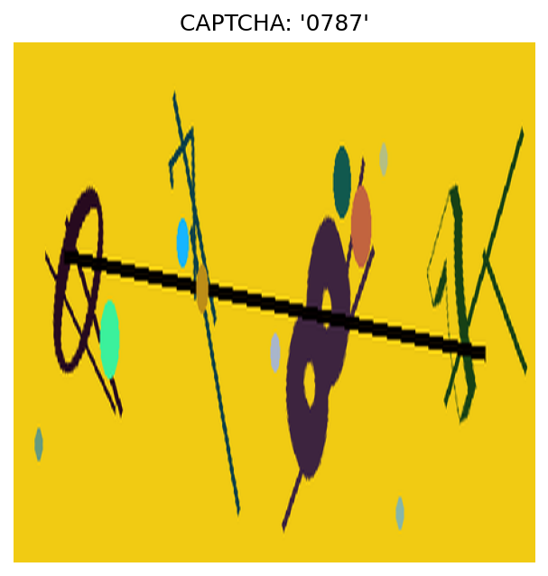
- 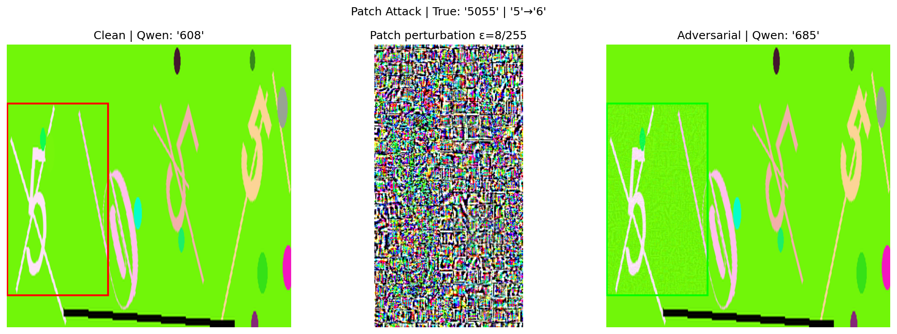
- 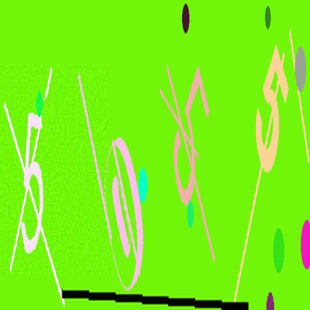
- 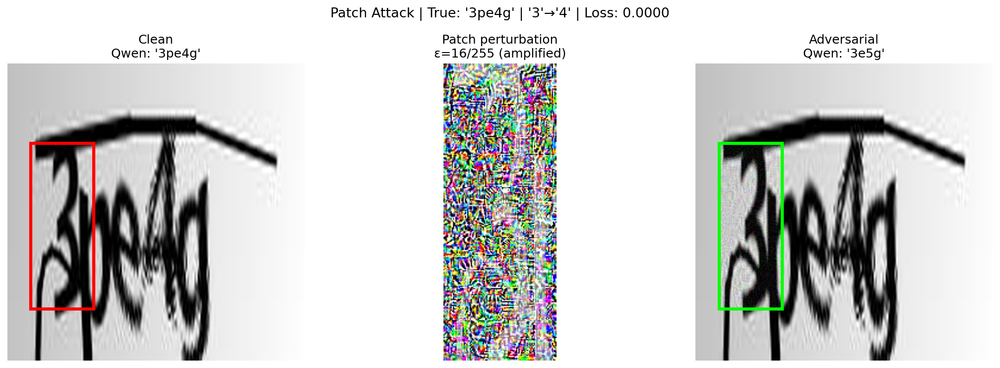

---

### Other Notebooks
- **Adverserial Amazon Search.ipynb:**
    - Focuses on adversarial search and web agent manipulation.
    - Visualizes clean and adversarial web pages.
    - Logs attack success and redirection evidence.
    - Example visuals:
        - 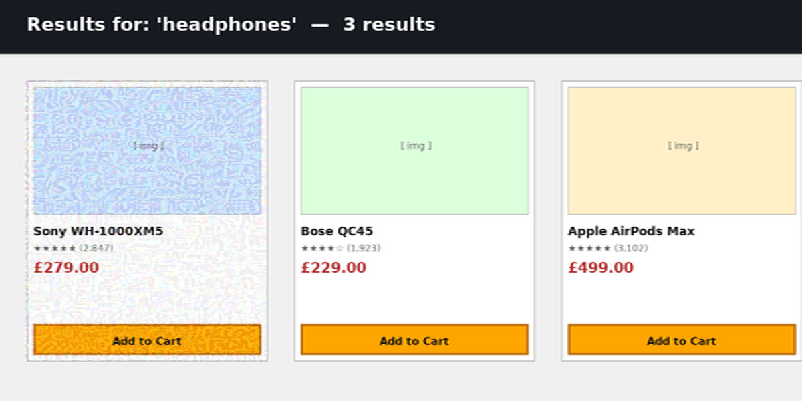
        - 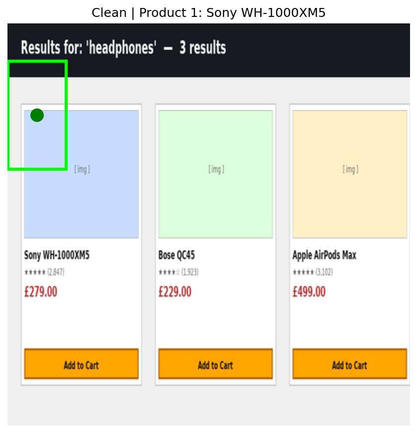
        - 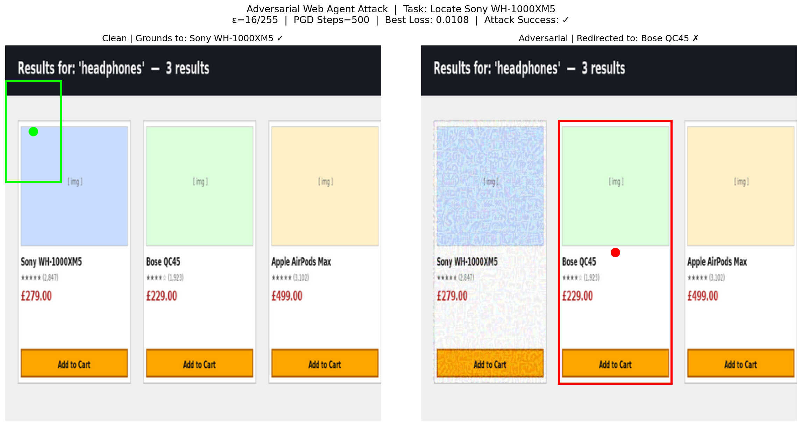
        - 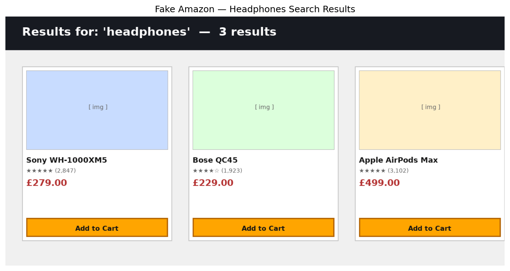

- **Captcha Attack Notebooks:**
    - Demonstrate adversarial attacks on captcha images.
    - Compare clean, grounded, and adversarial results.
    - Example visuals:
        - 
        - 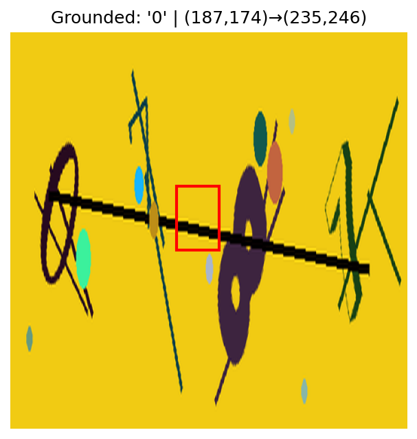
        - 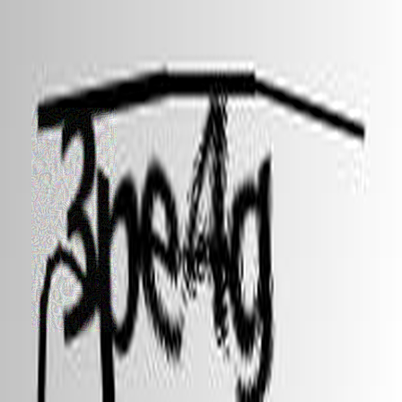
        - 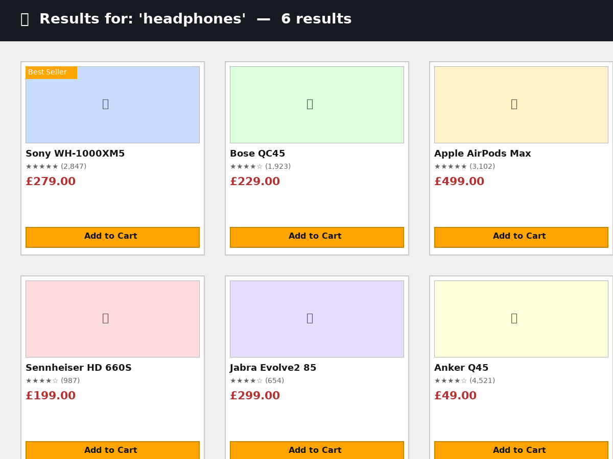

---

## Attack Methods Explained
- **PGD (Projected Gradient Descent):** Iteratively perturbs the image to maximize loss, constrained by epsilon.
- **MI-FGSM (Momentum Iterative FGSM):** Adds momentum to gradient updates for stronger attacks.
- **Ensemble Transfer:** Uses multiple models to guide perturbations, increasing robustness.
- **Qwen Merger:** Combines features from Qwen2_5_VL for more effective attacks.

---

## Step-by-Step Results
- **Image Loading:** Clean images are loaded and visualized.
- **Embedding Computation:** Model embeddings for clean and target images are calculated.
- **Attack Execution:** Adversarial perturbations are applied, guided by loss functions.
- **Visualization:** Clean, adversarial, and perturbation images are plotted and saved.
- **Metrics Logging:** Losses, cosine similarities, and attack scores are logged at each step.

---

## Visual Evidence
All referenced images are in the `plots` folder:
- 
- 
- 
- 
- 
- 
- 
- 
- 
- 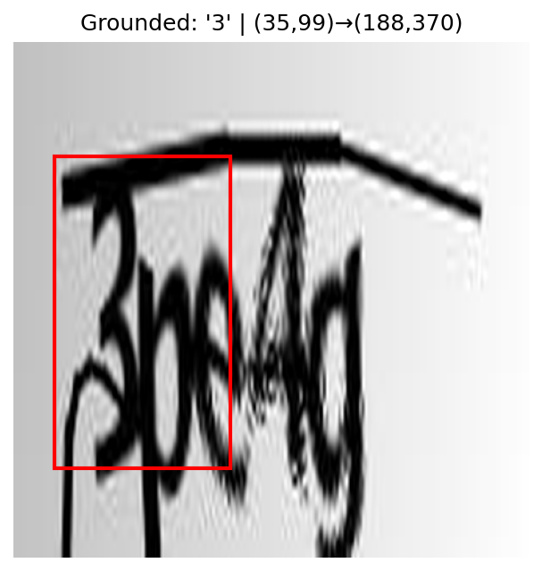
- 
- 

---

## Losses & Metrics
- **Loss Curves:** Step-by-step logs show loss evolution during attacks.
- **Attack Success:** Metrics indicate whether attacks succeeded (e.g., redirection, misclassification).
- **Cosine Similarity:** Used to measure embedding distance between clean and target images.
- **Best Loss:** Highlighted for each attack.

---

## How to Use
- Review the README and referenced images in `plots` for a complete understanding of each experiment.
- Each section provides step-by-step evidence and visual proof of adversarial attack effectiveness.

---

*Edit or expand sections as needed for your thesis or presentations.*
